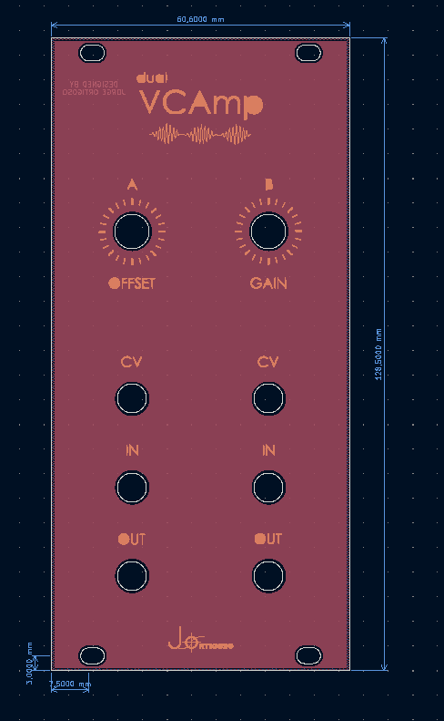
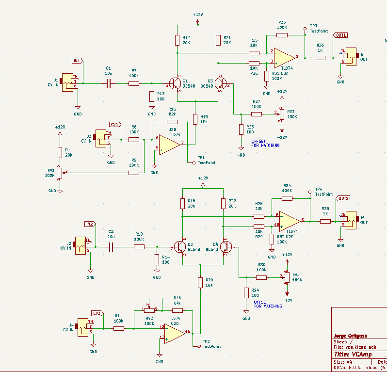

# VCAmp

PCB and Front Pannel designed by me based off the [Mortiz Klein VCA](https://www.youtube.com/c/MoritzKlein0). This designs blends some of the presented ideas to make the amplifier I wanted.

## Features
- **EURORACK** compatible. 100KOhm output and 1KOhm input impedances. Compatible with eurorack sizes standard (128.5mm (3U) x 12HP).
- Two oscillators with independent CV and outputs.
  - **AMP-A** Recieves a signal in the CV input, offset can be added with the *ofsset* knob to adjust its workign. 
  - **AMP-B** Recieves a signal in the CV input, gain to the CV signal can be added with the *gain* knob. The gain is calculated for a 5V inpur ADSR to get the maximum useful voltage when maxing out the gain, this is done beacuase I plan on using a step sequencer to control the volume, this way I can use SQ-1 as CV for my [Waves VCO](https://github.com/jortigoso/wavesVCO), then take the VCO's output and shape its envelope using the VCA's left channel. Next step would be to take the output and connect it to the second channel for controlling its amplitude using SQ-2 as volume CV.

## Components

Full list of components needed are included in the VCA.csv file. 

### Potentiometers
- Potentiometers are Vertical Alpha 9mmm. 
- Jack sockets are PJ301M-12.

### Capacitors

Input "coupling" capactior can be replaced for a different high value like 1uF for example, or even bypassed.

## Matching offset

Since the amplifier is based on a differential pair amplifier, the transistors have to be matched. Since standard BC547 transistors are being used, we can make reduce the matching difference by applying base voltage on the non-input transistor. 

- For the **left amp channel** matching pot is **RV3** trimmer.
- For the **right amp channel** matching pot is **RV4** trimmer.

Also any other matching would be useful, for example both the load resistors and the Differential Opamp (substractor) resistors.
 

